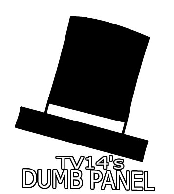

  

---

	
	
	

---

# 🎩Tv's Dumb Panel

Tv's Dumb Panel is a **dumb** port of II's Stupid Menu To Capuchin!

> Why settle for boring when you can have it *dumb* good?  

  
<b>💡 Why open-source?</b>

	
For other capuchin mod creators to use mods used for this menu!

  
<b>❓ Can I use your code?</b>

	
**Of course!** But there’s a catch: you gotta play fair. **[GPL-3.0 License](https://www.gnu.org/licenses/gpl-3.0.html) rules apply**, which means that if you use my code:  
- Your project **must** also be open-source.  
- Give credit where it's due.
- No shady stuff.
- **[Follow the license.](https://www.gnu.org/licenses/gpl-3.0.html)**

> "You wouldn’t steal a method." 
> [🎥 *(Or would you?)*](https://www.youtube.com/watch?v=zMBqPdMzZ9E)

  
<b>Is there support for bepinex?</b>

	
No, there is no support for bepinex due to capuchin no longer supporting bepinex as of the christmas update.

  
<b>🔗 Headset Compatibility</b>

	
lwk all headsets that support steam work

